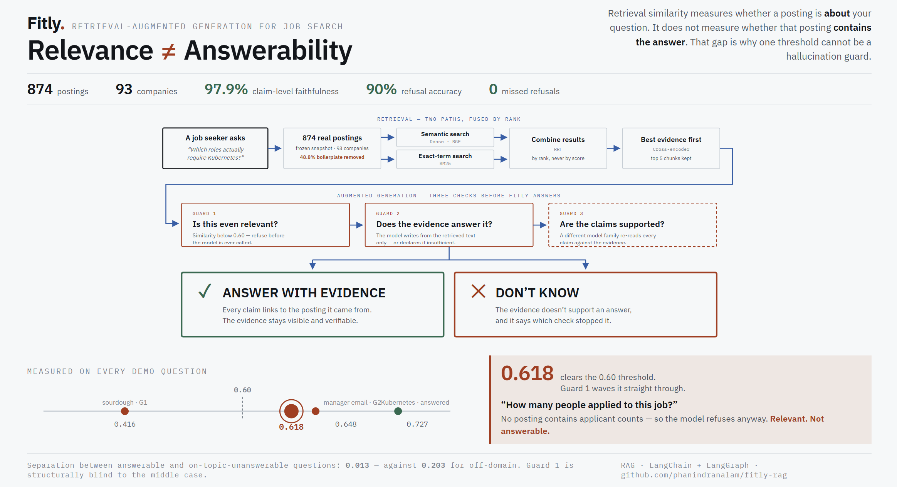

# Fitly

**Forty tabs open... Three hours before Monday. Which five jobs are actually worth applying to?**

Reading 850-odd job postings properly takes about **58 hours**,  four minutes each, and that's fast for a document written to be skimmed. Nobody does it. So everyone skims, applies to the wrong things, and hears nothing back.

Fitly reads them for you.
**Fitly** is an evidence-grounded job-search assistant built over 870 real postings from over 90 companies and it shows you the posting behind every single thing it tells you.

```
You:     Which roles actually require Kubernetes in production —
         not just mention it somewhere?

Fitly:   Perplexity's AI Infrastructure Engineer requires "managing
         large-scale Kubernetes deployments in production" [1]. Airbyte's
         Senior SRE requires "hands-on ownership of Kubernetes in
         production" [2]. Cockroach Labs' Production Services role
         requires "running Kubernetes in production" [4].

         [1] Perplexity     — Member of Technical Staff, AI Infrastructure
         [2] Airbyte        — Senior Site Reliability Engineer
         [3] Render         — Software Engineer, Network Infrastructure
         [4] Cockroach Labs — Member of Technical Staff, Production Services
         [5] Render         — Software Engineer, Infrastructure

         Five roles. Five citations. Every one opens the posting.
```

Every claim numbered. Every number opens the actual job ad. Nothing to take on faith.

---

**Now the half that took most of the work: the questions it won't answer.**

```
You:     How many people applied to this job?

Fitly:   I don't have enough information in the retrieved postings
         to answer that.
```

An ungrounded AI assistant can easily produce something like *"approximately 250 candidates, which is typical for a Senior SRE role."*

**That number does not exist.** Not in this posting, not in any posting — job ads don't contain application counts. It was invented, and it sounded completely reasonable, and you'd have no way to tell.

You're deciding where to spend a Sunday. Possibly where to spend the next three years. An assistant that makes things up at that moment is worse than no assistant at all.

So Fitly is built the other way round: **the refusal came first, and everything else was built around it.**

---
Fitly one-pager

---

## For the person actually doing the applying

You already know the parts nobody writes down. That a posting can run 900 words and
tell you almost nothing. That "5+ years required" sometimes means it and sometimes
doesn't. That you'll read forty of these on a Sunday, apply to six, hear back from
none — and never find out which of the six were even plausible.

Here is a measured version of that feeling. **48.8% of the text in these postings is
boilerplate** — EEO statements, benefits blurbs, "about us" paragraphs, the same words
in every ad the company publishes. You are not bad at reading job ads. Nearly half of
what you are reading is not about the job.

**What the tools do about it: nothing, or worse.**

Everything in this space optimizes for *more*. More matches, more results, one-click
applications. That serves the employer, who now sorts a bigger pile — and it works
against you, because your application is in the pile. The newer AI tools add a second
problem on top: a fluent, confident summary you have no way to check. It reads like
help. It might be invented, and you would never know.

**What Fitly does instead.** It doesn't find you more jobs. It reads the ones in front
of you, and it shows its work.

- **Every claim opens the posting it came from.** Any sentence it tells you can be
  checked in about five seconds. Nothing asks to be taken on trust.
- **When the postings don't say, it says so.** You will never act on a number Fitly
  invented, because it is built to fail toward *"I don't know"* — measured at **zero
  missed refusals** across twenty test questions, graded by a model that had no stake
  in the result.
- **It will never tell you you're unqualified.** Upload a resume and it says
  *"not evidenced in your resume"* — never *"you lack."* A keyword you didn't happen to
  write down is a gap in a document, not a gap in you. That distinction is written into
  the prompt as a rule, not left to the model's manners.

The benefit isn't speed. It's that after an hour you have a shorter list, a reason for
every name on it, and a link you can click to check any reason you doubt.

---

[**Full write-up**](docs/PROJECT.md) · [**Demo video**](<FILL: video url>)

---

## Four questions. One threshold. Three refusals.

Every question below was measured against the same 874-posting index. The number is
cosine similarity between the question and the best chunk retrieved for it — the
score this system uses to decide whether it is confident enough to answer.

```
                                    MIN_SIM
                                     0.60
                                       │
   0.416                               │ 0.618   0.648        0.727
     ●─────────────────────────────────┼───●───────●────────────●
     │                                 │   │       │            │
  sourdough                            │  how     who's the   Kubernetes
   recipe                              │  many?    hiring      in prod?
                                       │           manager?
  ✗ REFUSED                            │ ✗ REFUSED ✗ REFUSED   ✓ ANSWERED
    guard 1                            │  guard 2   guard 2     + citations
    model never called                 │
                                       │
       ◄── "nothing relevant here" ────┼──── "this looks relevant" ──►
```

Three of these four clear the confidence threshold. **Two of those three still cannot
be answered.** The postings that came back are genuinely about jobs — they just don't
contain a hiring manager's name or an application count.

That gap is what this project is about. A similarity score tells you whether you
retrieved something *related*. It cannot tell you whether the retrieved text *contains
the answer*. Measured across the full evaluation set, the separation between answerable
and unanswerable-but-on-topic questions is **+0.013** — noise. Against genuinely
off-domain questions it is **+0.203**.

So the score catches sourdough. Something else has to catch the hiring manager.

---

## Why refusing is the hard part

Refusing is easy when the question is obviously unrelated. Ask about sourdough and
nothing relevant comes back, so there's nothing to be tempted by.

The hard case is the question that *looks* answerable. "How many people applied" is
a question about a job, asked of a pile of job postings. Retrieval does its job
perfectly and hands back five genuinely relevant chunks. Every signal the system has
says *go ahead*.

**97.9% claim-level faithfulness · 0 missed refusals across 20 evaluation questions ·
graded by a different model family than the one writing the answers**

Those numbers are the whole point of the sections below: not that it answers well,
but that it was measured on how often it *shouldn't* answer and didn't.

## Try it in 60 seconds

A 40-posting sample corpus is committed, so you don't need to build anything:

```bash
python -m venv .venv && source .venv/bin/activate      # Windows: .venv\Scripts\activate
pip install -r requirements.txt
cp .env.example .env                                    # add your NEBIUS_API_KEY

python index.py --corpus data/corpus.sample.jsonl
streamlit run app.py
```

Embeddings run locally on CPU. **Only generation calls an API** — so indexing, hybrid retrieval, reranking, and the entire retrieval evaluation run with no key at all:

```bash
python index.py --corpus data/corpus.sample.jsonl
python eval/run_eval.py --retrieval --sweep-threshold    # zero API calls
```

You need a key only for the part that writes prose. Full-corpus build instructions are further down.

---

## Results

874 postings from 93 companies, fetched from Greenhouse, Ashby and Lever board APIs and then frozen to a JSONL snapshot so every experiment runs against identical input. 2,916 chunks. Evaluated on 20 hand-labelled questions — 13 answerable, 5 unanswerable but on-topic, 2 off-domain.

| | |
|---|---|
| Questions producing a fabricated answer | **0 / 20** |
| Missed refusals — should have declined, answered instead | **0 / 7** |
| Claim-level faithfulness | **97.9%** — 46 of 47 claims supported |
| Refusal accuracy | **90%** — 18/20; both errors were over-refusals |
| Dangling citations — pointing at a posting that wasn't retrieved | **0** |
| Best retrieval config | section-aware + hybrid + rerank — **100% hit@5, MRR 1.000** |
| Retrieval p95 | **4.29s** against a declared 5s budget |

The first two rows and the third measure different things, and the difference is the
honest part: **no question produced a fabricated answer, and one claim out of 47 was
still judged unsupported** — inside an answer that was otherwise grounded. "Zero
hallucinations" would collapse those into one sentence that reads better than the
evidence supports.

Two things worth knowing about these numbers before you trust them.

**The judge is a different model family from the generator** (`Qwen3-235B` grading `Llama-3.3-70B`). An earlier run scored 98.5% with the generator grading its own output — that's not a measurement, it's a model agreeing with itself. Swapping in an independent judge moved faithfulness *down* to 97.9% and refusal accuracy *down* to 90%. Both fell, which is why the new numbers are the ones I'd defend.

**Both refusal errors are the safe kind.** One question was refused at the similarity threshold that shouldn't have been; one correct answer was overturned by the verification guard for a structural reason described below. No question that should have been declined got answered instead — the failures all run toward "I don't know."

What that does *not* say is "zero hallucinations." One claim in 47 was judged unsupported. That is a different measurement from a missed refusal, and conflating them would make the headline stronger and less true.

---

## How it works

```
Greenhouse / Ashby / Lever
           │
           ▼
  Ingestion & cleaning          boilerplate detected from the data,
           │                    per employer — 48.8% of text removed
           ▼
  Section-aware chunking
           │
     ┌─────┴─────┐
     ▼           ▼
   Dense       BM25            embeddings catch paraphrase,
     │           │             BM25 catches literal strings
     └─────┬─────┘
           ▼
      RRF fusion               fuse by RANK, never by score
           │
           ▼
    Cross-encoder rerank
           │
           ▼
    ┌──────────────┐
    │ GUARD 1      │  cosine below threshold?  ──►  refuse, model never called
    └──────┬───────┘
           ▼
          LLM                  answers only from the retrieved text,
           │                   citations are integers it can't invent
           ▼
    ┌──────────────┐
    │ GUARD 2      │  model says INSUFFICIENT_CONTEXT?  ──►  refuse
    └──────┬───────┘
           ▼
    ┌──────────────┐
    │ GUARD 3      │  claims survive re-reading the context?  ──►  refuse if not
    └──────┬───────┘
           ▼
   Answer + job citations
```

**The LLM is not the database.** It doesn't decide which jobs exist or which are relevant — retrieval does that, and you can see exactly what it returned. The model's only job is reasoning over evidence that's already on the table, and refusing when the table is empty.

Everything from retrieval rightward is a LangGraph state machine (`graph.py`) with a conditional `widen` edge that retries with a larger `k` when the first pass comes back thin.

---

## Evidence, not a match percentage

Most job matchers give you `87% match`. That number can't be checked, can't be argued with, and isn't 87% of anything in particular.

The design principle here is that every requirement lands in one of three buckets:

```
                 JOB REQUIREMENT
                       │
          ┌────────────┼────────────┐
          ▼            ▼            ▼
        MATCH         GAP        UNKNOWN
          │            │            │
    evidence on     evidence     not enough
     both sides     conflicts     evidence
```

The third bucket is the one that doesn't exist in any job tool I've used, and it's the whole point.

> "I couldn't find evidence of a security clearance in your resume" — a true statement about a document.
>
> "You don't have a security clearance" — a guess about someone's life.

**What ships today:** resume skills are extracted by a deterministic keyword taxonomy, never by an LLM, so if Kubernetes appears in your skill list that string was in your document. The matching prompt is instructed to say *"not evidenced in your resume"* and never *"you lack."* Absence of evidence isn't evidence of absence — the refusal principle, applied to a person instead of a corpus.

**What's designed but not built:** the three-bucket breakdown with the supporting sentence quoted from both the posting and the resume, side by side. That's the roadmap, not a feature. Presenting it as shipped would be exactly the kind of plausible, confident, unverifiable claim this project exists to avoid.

Why skills aren't extracted by a model: ask an LLM to pull skills out of a resume and it returns a reasonable-looking list containing skills the person doesn't have, because it's completing a pattern. That's fine for a demo and disqualifying for a tool someone makes decisions with.

---

## The three decisions I'd defend in a code review

### 1. Two retrievers, fused by rank — never by score

Dense embeddings and BM25 fail on opposite inputs. Dense misses rare literal strings (`TS/SCI`, `Terraform 1.5`). BM25 misses paraphrase ("on-call rotation" vs "production support duties"). Running both is obvious.

Combining them is where people go wrong. The tempting move is `0.7 × cosine + 0.3 × bm25_score`. That's broken: cosine lives in [-1, 1] while BM25 is unbounded and corpus-dependent, so those weights are constants you tuned on today's corpus that silently rot as it grows.

Reciprocal Rank Fusion throws the scores away and keeps only the ranks:

```
RRF(doc) =  Σ   1 / (60 + rank_in_that_retriever)
         retrievers
```

Nothing to tune, no scale mismatch, no renormalizing. On real queries the two retrievers frequently return **completely disjoint** result sets — which is the entire argument for hybrid, visible on screen in the app's retrieval panel.

### 2. Fuse for order. Threshold on cosine for confidence.

I got this wrong first, and it's worth the paragraph.

My original refusal check thresholded the fused RRF score. That cannot work, for an arithmetic reason: the top result of *any* query scores about `1/61` per retriever that found it. A perfect answer and the least-irrelevant chunk in a corpus with nothing to say produce nearly the same number. An RRF threshold measures **how much the two retrievers agree**, not whether the result is any good — and it shifts when you switch dense-only vs hybrid, which would have made my own ablation move the refusal rate for reasons unrelated to quality.

So the two jobs are split:

```
RRF score   →   what order to show results in
cosine sim  →   whether we're confident enough to answer at all
```

Cosine is a real distance, comparable across chunking strategies, retrieval modes and values of k. `MIN_SIM` comes from `--sweep-threshold`, which walks the threshold across the labelled set and prints where answerable and unanswerable questions actually separate. Not from me picking a round number.

### 3. Location is a hard pre-filter, not a ranking signal

Chroma narrows the search space *before* computing nearest neighbours. The alternative — retrieve 20, then discard the ones in the wrong city — looks equivalent and isn't: if all 20 nearest chunks happen to be California roles, an Atlanta user gets zero results and no explanation.

BM25 applies the byte-identical predicate in Python. A hybrid retriever whose two halves filter differently quietly reintroduces exactly what the filter was there to remove.

---

## The finding I'd put my name on

I assumed cosine similarity could separate *answerable* questions from *unanswerable* ones. That assumption is the entire premise of guard 1.

The evaluation said the gap was **0.013**. Statistically nothing.

The reason turned out to be that every trap question was still *about jobs*. "What was revenue last quarter" is topically adjacent to a job posting — it's about the company — so retrieval happily returns company chunks at high similarity that simply don't contain revenue. When I added genuinely off-domain questions (sourdough recipes, brake pads), the gap jumped to **0.203**.

```
   answerable  vs  off-CONTENT     +0.084     right topic, wrong information
   answerable  vs  off-DOMAIN      +0.203     wrong topic entirely
                                              ── 2.4× wider ──
```

**Similarity measures topic. It does not measure answerability.**

Guard 1 is structurally incapable of catching off-content questions. Only guard 2, which reads the actual text, can:

```
                            off-DOMAIN          off-CONTENT
                        (sourdough recipe)   (hiring manager)

   guard 1  (cosine)         catches              BLIND
   guard 2  (model reads)    catches             catches
```

The two guards were never redundancy. They cover disjoint failure modes, and there's now data proving it.

This generalizes well past job postings. An HR bot retrieves the parental-leave policy perfectly when you ask for a number the policy doesn't state. A finance RAG pulls exactly the right 10-K section for a metric that isn't in it. **Perfect retrieval, zero answer.** Any system that gates refusal on retrieval score alone has this hole.

---

## Seven things I got wrong

Full write-ups in [`docs/PROJECT.md`](docs/PROJECT.md) §8. Short version, because the pattern matters more than the individual bugs:

| | What I believed | What was true |
|---|---|---|
| 01 | The boilerplate detector found none, so there must not be much | It counted fingerprints globally. Boilerplate is written **per employer** — Stripe's EEO statement names Stripe. My cutoff was 312 documents when the ceiling was 25. Zero was arithmetically guaranteed. Counting per employer: **48.8% of the corpus removed** |
| 02 | 101 postings support this eval question | Substring matching. `"phi"` matched inside `"sophisticated"`. Real count: 2 |
| 03 | Similarity separates answerable from unanswerable | +0.013. See above |
| 04 | This question is a trap — postings don't state leave durations | 190 sentences do. **The label was the bug**, written *after* I'd already learned this exact lesson once |
| 05 | 384 dimensions is right because it matches the chunk size | Reads like physics, isn't. It survived every test because nothing here tested it. A reviewer caught it, not me |
| 06 | 98.5% faithfulness | Generator, verifier and judge were all one model. That's not a measurement, that's Llama agreeing with Llama. Independent judge: **97.9%, and refusal accuracy fell too** |
| 07 | Guard 3 never fires, so it's untested | It fired once — and overturned a **correct** answer about which languages appear most often. It was right to: that claim is about 2,916 chunks and it saw 5. **Aggregate questions are structurally unverifiable in chunk-based RAG** |

All seven share a shape. **The code ran without error and produced a confident, wrong number.** Nothing crashed. A test suite would have passed every one. They were caught by comparing output against what the data should plausibly contain — and one of them needed a different pair of eyes entirely.

Which is my real takeaway from building this with an AI pair programmer. The failure mode isn't broken code; broken code announces itself. It's *plausible* code that runs clean.

---

## Building the full corpus

`build_corpus.py` needs a clone of [Fitly](https://github.com/phanindranalam/fitly) beside this folder — it reuses that project's ATS fetchers and geography parser rather than reimplementing them. The coupling runs one way: this project reads from Fitly, never the reverse.

```bash
python build_corpus.py --fitly-path ../fitly --out data/corpus.jsonl --limit-per-board 10
python index.py                    # builds both chunking collections
python smoke_test.py               # 12 checks — run this before demoing anything
streamlit run app.py
```

Neither `data/corpus.jsonl` nor `data/chroma/` is committed; the index is ~107 MB and rebuilds in about four minutes. If Nebius is down mid-demo, retrieval still works and you can show the retrieved chunks — you just don't get prose.

## Evaluation

```bash
python eval/run_eval.py --retrieval --sweep-threshold   # no API calls, ~1 min
python eval/run_eval.py --generate                      # adds the LLM judge
```

The retrieval matrix runs **2 chunking strategies × dense/hybrid × rerank on/off**, reporting term-hit rate, MRR, and how far apart the similarity distributions of answerable and unanswerable questions sit. `--sweep-threshold` walks `MIN_SIM` across the labelled set so the threshold comes from a curve instead of a hunch.

Results land in `eval/results/` as JSON and markdown. **Nine runs are committed on purpose** — you can watch the numbers move as the bugs above got found and fixed, which is more informative than the final row alone.

Set `JUDGE_MODEL` / `VERIFY_MODEL` to the generator's model to reproduce the weaker self-graded setup and measure the difference yourself. `config.describe()` prints `independent` or `SAME AS GENERATOR` on every run, so any terminal transcript shows which one you were looking at.

## Repo map

| File | What it does |
|---|---|
| `build_corpus.py` | Fetch from ATS boards; detect boilerplate from the data, per employer |
| `chunking.py` | Two strategies side by side — section-aware and fixed-window (LangChain's `RecursiveCharacterTextSplitter`) |
| `embeddings.py` | bge-small on CPU, ONNX backend, asymmetric query prefix |
| `index.py` | Chroma, cosine space, one collection per chunking strategy |
| `retrieve.py` | Dense + BM25, RRF fusion, metadata pre-filtering, cosine confidence |
| `rerank.py` | Cross-encoder over the fused candidates |
| `graph.py` | LangGraph state machine: retrieve → guard → generate → verify, with `widen` retry |
| `generate.py` | Prompts, integer citations, guards 2 and 3 |
| `resume_loader.py` | LlamaParse with pypdf fallback; skills from a keyword taxonomy, never from an LLM |
| `app.py` | Streamlit UI, including the panel that shows both retrievers' ranks side by side |
| `eval/run_eval.py` | The full matrix plus the faithfulness judge |
| `make_sample.py` | Cuts the committable 40-posting sample out of the full corpus |
| `smoke_test.py` | 12 end-to-end checks |

---

## What this doesn't do

- **The corpus is a frozen snapshot.** Postings close. Right trade for reproducibility, wrong one for actually applying to jobs.
- **Retrieval labels are term-level**, not human relevance judgements. Measures vocabulary, a proxy for recall. Real labels would need hand-annotation and would break on every re-chunk.
- **The judge is a different model, not a human.** Removing the shared-blind-spot problem isn't the same as removing the LLM-as-judge problem.
- **Guard 3 has a known false-positive class** — aggregate questions (finding 07). Until those route to a metadata query instead of the retriever, it will keep refusing them.
- **20 questions is small.** Enough to rank configurations. Not enough for tight confidence intervals.
- **Titles and years of experience come from regexes**, so creative titles are missed and career gaps inflate the count. Both surfaced as approximate.

## Roadmap

The engine answers *"what do these postings say."* The product question underneath is sharper: **of these 127 jobs, which 10 deserve my time — and show me why.**

Three pieces of real engineering sit between here and that:

1. **The Match / Gap / Unknown breakdown**, with the supporting sentence quoted from both the posting and the resume, side by side.
2. **Live re-ingestion** — new / updated / closed, keyed on the ATS `updated_at` field — replacing the frozen snapshot, with a visible "last verified" timestamp.
3. **Posting quality scoring.** Not "does your resume match this job" but "did this employer give you enough information to decide?" Salary disclosed, responsibilities specific, seniority clear. Entirely deterministic, no LLM involved, and it lets you deprioritize postings that were never going to tell you anything.

Ranking will be by a real quantity — *satisfies 8 of 9 required qualifications*, clickable to see the nine — not by a synthesized percentage. A number nobody can audit is the thing this project was built to avoid.

---

**Full write-up:** [`docs/PROJECT.md`](docs/PROJECT.md) · **Demo script:** [`docs/VIDEO_SCRIPT.md`](docs/VIDEO_SCRIPT.md)
