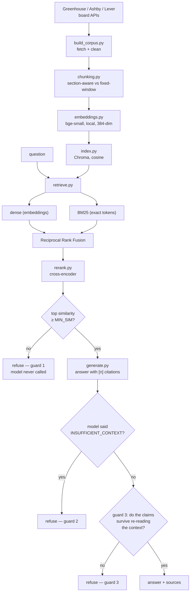

# Fitly RAG

**Ask questions about real job postings. Get the posting back with the answer — or get told the postings don't say.**

Most of the effort here went into the second half of that sentence.

---

## The thing I was actually trying to build

I started with a question I kept hitting during my own job search: *does this posting actually require Kubernetes, or does it just mention it?* Reading 800 job descriptions to find out is not a good use of an evening.

So the obvious build is a chatbot over job postings. But there's a failure mode that makes that idea worse than useless, and it shows up immediately:

```
Q: How many people applied to this job?

A bad RAG system: "Approximately 250 candidates have applied to this
                   position, which is typical for a Senior SRE role."

What's true:       Job postings do not contain application counts.
                   Not one. That number was invented.
```

A search engine that returns nothing is annoying. An assistant that confidently invents a number, in a context where you're making decisions about your career, is worse than annoying. So I designed the refusal path before I designed the answer path, and most of this repo is the machinery for knowing when to shut up.

Here's what it does instead:

```
Q: How many people applied to this job?
→ I don't have enough information in the retrieved postings to answer that.
   (top similarity 0.31, below threshold 0.60 — the model was never called)

Q: Who is the hiring manager for this role?
→ I don't have enough information in the retrieved postings to answer that.
   (retrieval was confident; the model read the text and said the answer isn't in it)

Q: Which roles require running Kubernetes in production?
→ Three postings require production Kubernetes experience. [1] asks for
   "operating Kubernetes at scale in production," [3] for "managing multi-
   cluster Kubernetes environments"...
   [1] Ramp — Senior Infrastructure Engineer  → boards.greenhouse.io/...
   [3] Chime — Staff SRE                      → jobs.ashbyhq.com/...
```

Those first two refusals fire through **different mechanisms**, and finding out why is the most interesting result in the project. More on that below.

---

## Numbers

874 postings from 93 companies, pulled live from Greenhouse, Ashby and Lever board APIs. 2,916 chunks. Evaluated on 20 hand-labelled questions.

| | |
|---|---|
| Refusal accuracy | **90%** (18/20) |
| Answers containing an unsupported claim | **0** |
| Faithfulness | **97.9%** — 1 unsupported claim in 47 |
| Citations pointing at a posting that wasn't retrieved | **0** |
| Retrieval p95 | **4.29s** (declared budget: 5s) |
| Best retrieval config | section-aware chunks + hybrid + rerank — **100% hit@5, MRR 1.000** |

The faithfulness judge is a **different model family** from the generator (`Qwen3-235B` grading `Llama-3.3-70B`). That matters more than the number itself, and it's the subject of one of the findings below.

---

## How it works



Everything from `retrieve` rightward is a LangGraph state machine (`graph.py`) with a conditional `widen` edge that retries with a larger `k` when the first pass comes back thin.

---

## The three decisions I'd defend in a code review

### 1. Two retrievers, fused by rank — never by score

Dense embeddings and BM25 fail on opposite inputs. Dense misses rare literal strings (`TS/SCI`, `Terraform 1.5`). BM25 misses paraphrase ("on-call rotation" vs "production support duties"). Running both is obvious.

Combining them is where people go wrong. The tempting move is `0.7 × cosine + 0.3 × bm25_score`. That's broken: cosine lives in [-1, 1] and BM25 is unbounded and corpus-dependent, so those weights are a constant you tune on your corpus and that silently rots the moment the corpus grows.

Reciprocal Rank Fusion throws the scores away and keeps only the ranks:

```
RRF(doc) = Σ  1 / (60 + rank_in_that_retriever)
        retrievers
```

Nothing to tune, nothing to renormalize, no scale mismatch. On real queries the two retrievers frequently return **completely disjoint** result sets — which is the whole argument for hybrid, visible on screen in the app's retrieval panel.

### 2. Fuse for order. Threshold on cosine for confidence.

This one I got wrong first and it's worth the paragraph.

My original refusal check thresholded the fused RRF score. That cannot work, and the reason is arithmetic: the top result of *any* query scores about `1/61` per retriever that found it. A perfect answer and the least-irrelevant chunk in a corpus with nothing to say produce nearly the same number. An RRF threshold measures **how much the two retrievers agree**, not whether the result is any good — and it moves when you switch dense-only vs hybrid, which would have made my own ablation shift the refusal rate for reasons having nothing to do with quality.

So the two jobs are split:

```
RRF score   →  what order to show results in
cosine sim  →  whether we're confident enough to answer at all
```

Cosine is a real distance, comparable across chunking strategies, retrieval modes and values of k. `MIN_SIM` is picked by `--sweep-threshold`, which walks the threshold across the labelled set and prints where answerable and unanswerable questions actually separate. Not by me guessing a round number.

### 3. Location is a hard pre-filter, not a ranking signal

Chroma narrows the search space *before* computing nearest neighbours. The alternative — retrieve 20, then throw away the ones in the wrong city — looks equivalent and isn't: if all 20 nearest chunks happen to be California roles, an Atlanta user gets zero results and no explanation.

BM25 applies the byte-identical predicate in Python. A hybrid retriever whose two halves filter differently quietly reintroduces exactly what the filter was there to remove.

---

## The finding I'd put my name on

I assumed cosine similarity could separate *answerable* questions from *unanswerable* ones. That's the entire premise of guard 1.

The evaluation said the gap was **0.013**. Statistically nothing.

The reason turned out to be that all my trap questions were still *about jobs*. "What was revenue last quarter" is topically adjacent to a job posting — it's about the company — so retrieval happily returns company chunks at high similarity that simply don't contain revenue. When I added genuinely off-domain questions (sourdough recipes, brake pads), the gap jumped to **0.203**.

```
                answerable   vs   off-CONTENT     +0.084
                (right topic, wrong information)

                answerable   vs   off-DOMAIN      +0.203
                (wrong topic entirely)                      2.4× wider
```

**Similarity measures topic. It does not measure answerability.** Guard 1 is structurally incapable of catching off-content questions — only guard 2, which reads the actual text, can. The two guards were never redundancy. They cover disjoint failure modes, and now there's data proving it:

```
                          off-DOMAIN        off-CONTENT
                       (sourdough recipe)  (hiring manager)
   guard 1 (cosine)          catches           BLIND
   guard 2 (model reads)     catches           catches
```

This generalizes well past job postings. An HR bot retrieves the parental-leave policy perfectly when you ask for a number the policy doesn't state. A finance RAG pulls the right 10-K section for a metric that isn't in it. **Perfect retrieval, zero answer.** Any system that gates refusal on retrieval score alone has this hole.

---

## Seven things I got wrong

The full write-ups are in [`docs/PROJECT.md`](docs/PROJECT.md) §8. Short version, because the pattern is the point:

| | What I believed | What was true |
|---|---|---|
| 01 | The boilerplate detector found no boilerplate, so there must not be much | It counted fingerprints globally. Boilerplate is written **per employer** — Stripe's EEO statement names Stripe. My cutoff was 312 documents when the ceiling was 25. Zero was arithmetically guaranteed. Counting per employer: **48.8% of the corpus removed** |
| 02 | 101 postings support this eval question | Substring matching. `"phi"` matched inside `"sophisticated"`. Real count: 2 |
| 03 | Similarity separates answerable from unanswerable | +0.013. See above |
| 04 | This eval question is a trap; postings don't state leave durations | 190 sentences do. **The label was the bug**, written after I'd already learned this lesson once |
| 05 | 384 dimensions is right because it matches the chunk size | Reads like physics, isn't. Nothing here measured it. A reviewer caught it, not me |
| 06 | 98.5% faithfulness | Generator, verifier and judge were all the same model. That's not a measurement, that's Llama agreeing with Llama. Independent judge: **97.9%, and refusal accuracy fell too.** Both dropped, which is the point |
| 07 | Guard 3 never fires, so it's untested | It fired once — and overturned a **correct** answer about which languages appear most often. It was right to: that claim is about 2,916 chunks and it saw 5. **Aggregate questions are structurally unverifiable in chunk-based RAG** |

All seven share a shape. **The code ran without error and produced a confident, wrong number.** Nothing crashed. A test suite would have passed every one of them. They were caught by comparing output against what the data should plausibly contain — and one of them needed a different pair of eyes entirely.

That's my actual takeaway from building this with an AI pair programmer. The failure mode isn't broken code; broken code announces itself. It's *plausible* code that runs clean.

---

## Running it

```bash
python -m venv .venv
source .venv/bin/activate          # Windows: .venv\Scripts\activate
pip install -r requirements.txt
cp .env.example .env               # add your NEBIUS_API_KEY
```

**Try it without building a corpus** (uses the committed sample, ~40 postings):

```bash
python index.py --corpus data/corpus.sample.jsonl
streamlit run app.py
```

**Build the full corpus yourself.** This needs a clone of [Fitly](https://github.com/phanindranalam/fitly) beside this folder — `build_corpus.py` reuses its ATS fetchers and geography parser rather than reimplementing them. The coupling runs one way: this project reads from Fitly, never the reverse.

```bash
python build_corpus.py --fitly-path ../fitly --out data/corpus.jsonl --limit-per-board 10
python index.py                    # builds both chunking collections
python smoke_test.py               # 12 checks, run this before demoing anything
streamlit run app.py
```

Neither `data/corpus.jsonl` nor `data/chroma/` is committed — the index is ~107 MB and rebuilds in about four minutes.

Embeddings run locally on CPU (bge-small). Only generation calls an API, once per answer. If Nebius is down mid-demo, retrieval still works and you can show the retrieved chunks; you just don't get prose.

## Evaluation

```bash
python eval/run_eval.py --retrieval --sweep-threshold   # no API calls, ~1 min
python eval/run_eval.py --generate                      # adds the LLM judge
```

The retrieval matrix runs **2 chunking strategies × dense/hybrid × rerank on/off** and reports term-hit rate, MRR, and how far apart the similarity distributions of answerable and unanswerable questions sit. `--sweep-threshold` walks `MIN_SIM` across the labelled set so the threshold comes from a curve instead of a hunch. Results land in `eval/results/` as JSON and markdown; nine runs are committed so you can watch the numbers move as the bugs above got fixed.

Set `JUDGE_MODEL` / `VERIFY_MODEL` to the generator's model to reproduce the weaker self-graded setup and measure the difference. `config.describe()` prints `independent` or `SAME AS GENERATOR` on every run, so any terminal transcript shows which one you were looking at.

## Repo map

| File | What it does |
|---|---|
| `build_corpus.py` | Fetch from ATS boards; detect boilerplate from the data, per employer |
| `chunking.py` | Two strategies side by side — section-aware and fixed-window (LangChain's `RecursiveCharacterTextSplitter`) |
| `embeddings.py` | bge-small on CPU, ONNX backend, asymmetric query prefix |
| `index.py` | Chroma, cosine space, one collection per chunking strategy |
| `retrieve.py` | Dense + BM25, RRF fusion, metadata pre-filtering, cosine confidence |
| `rerank.py` | Cross-encoder over the fused candidates |
| `graph.py` | LangGraph state machine: retrieve → guard → generate → verify, with `widen` retry |
| `generate.py` | Prompts, integer citations, guards 2 and 3 |
| `resume_loader.py` | LlamaParse with pypdf fallback; skills from a keyword taxonomy, **never** from an LLM |
| `app.py` | Streamlit UI, including the retrieval panel that shows both retrievers' ranks |
| `eval/run_eval.py` | The whole matrix, plus the faithfulness judge |
| `smoke_test.py` | 12 end-to-end checks |

Why skills are extracted by keyword and not by a model: ask an LLM to pull skills out of a resume and it returns a plausible list containing skills the person doesn't have, because it's completing a pattern. If Kubernetes appears in Fitly's skill list, that string was in the document.

The same philosophy runs through the resume-matching prompt, which is instructed to say *"not evidenced in your resume"* and never *"you lack."* Absence of evidence isn't evidence of absence — that's the refusal principle applied to a person instead of a corpus.

---

## What this doesn't do

- **The corpus is a frozen snapshot.** Postings close. Right trade for reproducibility, wrong one for actually applying to jobs.
- **Retrieval labels are term-level**, not human relevance judgements. Measures vocabulary, which is a proxy for recall. Real labels would need hand-annotation and would break on every re-chunk.
- **The judge is a different model, not a human.** Removing the shared-blind-spot problem isn't the same as removing the LLM-as-judge problem.
- **Guard 3 has a known false-positive class** — aggregate questions (finding 07). Until those route to a metadata query instead of the retriever, it'll keep refusing them.
- **20 questions is small.** Enough to rank configurations. Not enough for tight confidence intervals.
- **Titles and years of experience come from regexes**, so creative titles are missed and career gaps inflate the count. Both surfaced as approximate.

## Where this goes

The engine answers *"what do these postings say."* The product question underneath it is sharper: **"of these 127 jobs, which 10 deserve my time — and show me why."**

That means the retrieval work here becomes an evidence layer rather than a chat box, and every match decomposes into three buckets rather than a percentage:

```
                     JOB REQUIREMENT
                            │
             ┌──────────────┼──────────────┐
             ▼              ▼              ▼
           MATCH           GAP          UNKNOWN
             │              │              │
        evidence on    evidence      not enough
         both sides     conflicts      evidence
```

The third bucket is the one that doesn't exist in any job-matching tool I've used, and it's the direct descendant of everything above. "I couldn't find evidence of a security clearance in your resume" is a true statement. "You don't have a security clearance" is a guess about a person's life, and the whole point of this project is not making those.

Live re-ingestion (new / updated / closed, keyed on the ATS `updated_at`) and a weighted, user-adjustable fit score are the two pieces of real engineering between here and that.

---

**Full write-up:** [`docs/PROJECT.md`](docs/PROJECT.md) · **Demo script:** [`docs/VIDEO_SCRIPT.md`](docs/VIDEO_SCRIPT.md)
